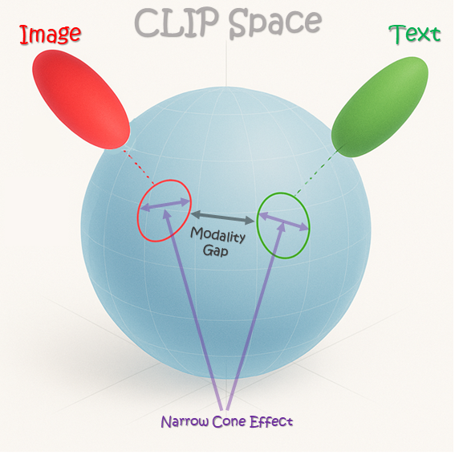

# The Double-Ellipsoid Geometry of CLIP (ICML 2025)
	
Official pytorch implementation of the paper ["The Double-Ellipsoid Geometry of CLIP"](https://arxiv.org/abs/2411.14517).

Meir Yossef Levi, Guy Gilboa



We uncover a double-ellipsoid structure in CLIP’s latent space by analyzing the raw (pre-normalized) features. Each modality—image and text—is embedded in its own ellipsoid, both shifted away from the origin.

Furthermore, we observe that more "common" samples (i.e. "an image of a dog") tend to lie closer to the center of their modality's ellipsoid, measured by cosine similarity to the modality mean. We define this property as Conformity.

Finally, we show that under this two-ellipsoid geometry, the KL-Divergence between the conformity distributions of images and texts reaches its maximum, indicating that the modality gap in CLIP arises from differences in how conformity is distributed across modalities.

## Double-Ellipsoid notebook:
[](https://colab.research.google.com/gist/yossilevii100/ce4cae6c26e7c3d3358c4fb7dda3bec4/untitled5.ipynb)
## Get Started

### Clone the Repo
```shell
git clone https://github.com/yossilevii100/double-ellipsoid-clip.git
cd double-ellipsoid-clip
```

## Cite Double-Ellipsoid
```bibtex
@article{levi2024double,
  title={The Double-Ellipsoid Geometry of CLIP},
  author={Levi, Meir Yossef and Gilboa, Guy},
  journal={arXiv preprint arXiv:2411.14517},
  year={2024}
}
```


